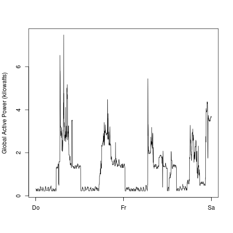

# ExData_Plotting1
Exploratory Data Analysis Plotting Exercise

## Introduction

This is a solution to Project1 of Coursera Course on Exloratory Data Analysis.The implentation is based on the descriptions in: [https://github.com/rdpeng/ExData_Plotting1](https://github.com/rdpeng/ExData_Plotting1)

The data used is "Individual household electric power consumption Data Set" (<a href="https://d396qusza40orc.cloudfront.net/exdata%2Fdata%2Fhousehold_power_consumption.zip">Electric power consumption</a>) from <a href="http://archive.ics.uci.edu/ml/">UC Irvine Machine Learning Repository</a>. The implementation requires the user to store the dataset into the same directory as the R code when downloaded from this repository. Only data from the dates 2007-02-01 and 2007-02-02 is read the data from file.

## Plots

### Plot 1

 

### Plot 2

 

### Plot 3

 

### Plot 4

 
