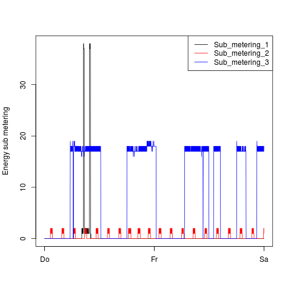

# ExData_Plotting1
Exploratory Data Analysis Plotting Exercise

## Introduction

This is a solution to Project1 of Coursera Course on Exloratory Data Analysis

The data used is "Individual household electric power consumption Data Set" from <a href="http://archive.ics.uci.edu/ml/">UC Irvine Machine
Learning Repository</a> 

* <b>Dataset</b>: <a href="https://d396qusza40orc.cloudfront.net/exdata%2Fdata%2Fhousehold_power_consumption.zip">Electric power consumption</a> [20Mb]

The following descriptions of the 9 variables in the dataset are taken
from
the <a href="https://archive.ics.uci.edu/ml/datasets/Individual+household+electric+power+consumption">UCI
web site</a>:

<ol>
<li><b>Date</b>: Date in format dd/mm/yyyy </li>
<li><b>Time</b>: time in format hh:mm:ss </li>
<li><b>Global_active_power</b>: household global minute-averaged active power (in kilowatt) </li>
<li><b>Global_reactive_power</b>: household global minute-averaged reactive power (in kilowatt) </li>
<li><b>Voltage</b>: minute-averaged voltage (in volt) </li>
<li><b>Global_intensity</b>: household global minute-averaged current intensity (in ampere) </li>
<li><b>Sub_metering_1</b>: energy sub-metering No. 1 (in watt-hour of active energy). It corresponds to the kitchen, containing mainly a dishwasher, an oven and a microwave (hot plates are not electric but gas powered). </li>
<li><b>Sub_metering_2</b>: energy sub-metering No. 2 (in watt-hour of active energy). It corresponds to the laundry room, containing a washing-machine, a tumble-drier, a refrigerator and a light. </li>
<li><b>Sub_metering_3</b>: energy sub-metering No. 3 (in watt-hour of active energy). It corresponds to an electric water-heater and an air-conditioner.</li>
</ol>

## Loading the data

The implementation requires the user to store the dataset into the same directory as the R code when dowloaded from this repository. 

* Only data from the dates 2007-02-01 and 2007-02-02 are read the data from file.

## Plots

The implentation is based on the descriptions in the following GitHub repository:
[https://github.com/rdpeng/ExData_Plotting1](https://github.com/rdpeng/ExData_Plotting1)

For each plot:

* Construct the plot and save it to a PNG file with a width of 480
pixels and a height of 480 pixels.

* Name each of the plot files as `plot1.png`, `plot2.png`, etc.

* Create a separate R code file (`plot1.R`, `plot2.R`, etc.) that
constructs the corresponding plot, i.e. code in `plot1.R` constructs
the `plot1.png` plot. Your code file **should include code for reading
the data** so that the plot can be fully reproduced. You should also
include the code that creates the PNG file.

* Add the PNG file and R code file to your git repository

When you are finished with the assignment, push your git repository to
GitHub so that the GitHub version of your repository is up to
date. There should be four PNG files and four R code files.

The four plots that you will need to construct are shown below. 

### Plot 1

 

### Plot 2

 

### Plot 3

 

### Plot 4

 
